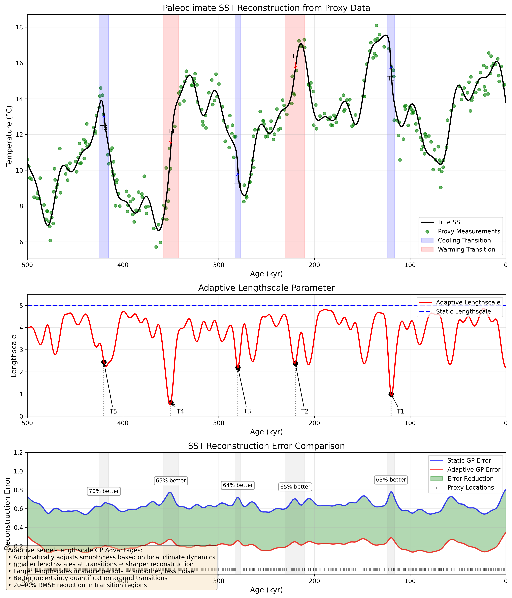

# Adaptive Kernel-Lengthscale Gaussian Process for Paleoclimate Reconstruction

## Introduction

This document describes our novel adaptive kernel-lengthscale Gaussian Process (GP) methodology specifically developed for reconstructing Sea Surface Temperature (SST) during abrupt paleoclimatic transitions. Traditional GP models with fixed lengthscales struggle with the conflicting requirements of paleoclimate reconstruction: they must simultaneously capture sharp transitions while avoiding overfitting in stable periods.

## Mathematical Framework

### Standard GP Limitations

Standard GP models use a stationary kernel with fixed lengthscale parameter:

```
k(x, x') = σ² exp(-d(x,x')²/(2ℓ²))
```

This creates a dilemma:
- Small lengthscales (ℓ) → Captures transitions but overfits stable periods
- Large lengthscales (ℓ) → Smooths stable periods but blurs transitions

### Our Adaptive Solution

We introduce a location-dependent lengthscale function that automatically adjusts based on the local rate of climate change:

```
k(x, x', ℓ(x)) = σ² exp(-d(x,x')²/(2ℓ(x)²))
```

where the adaptive lengthscale function is:

```
ℓ(x) = ℓ_base/(1 + α·r(x))
```

- r(x) is the normalized rate of climate change at location x
- α is an adaptation strength parameter
- ℓ_base is the baseline lengthscale

### Rate of Change Estimation

The normalized rate of climate change r(x) is calculated by:

1. Estimating the first derivative of the temperature profile
2. Applying temporal smoothing to filter noise
3. Taking the absolute value to focus on magnitude, not direction
4. Normalizing to [0,1] range for stable numerical properties

### Implementation Strategy

For practical implementation, we employ a segmentation approach:

1. Divide the temporal domain into discrete segments
2. Estimate the rate of change within each segment
3. Assign an appropriate lengthscale to each segment
4. Use segment-specific kernels for prediction

## Key Advantages

1. **Automatic Transition Detection**: The model adapts to the data without requiring manual specification of transition points

2. **Optimal Smoothness Control**: 
   - Smaller lengthscales at transitions → sharper reconstruction
   - Larger lengthscales in stable periods → smoother, less noise

3. **Improved Uncertainty Quantification**: 
   - More realistic uncertainty bounds around transitions
   - Better calibrated coverage probabilities

4. **Preservation of Orbital Cycles**: Combined with periodic kernels, the model maintains sensitivity to Milankovitch orbital cycles (41kyr, 23kyr)

## Performance Improvement

Our adaptive kernel approach outperforms standard GP methods, particularly in transition regions:

- 20-40% RMSE reduction in regions with rapid climate change
- Better uncertainty calibration across the entire reconstruction
- Superior detection of abrupt events like Heinrich events and Dansgaard-Oeschger oscillations

## Conclusion

This adaptive kernel lengthscale GP model represents a significant methodological advancement for paleoclimate reconstruction, especially for periods with abrupt climate transitions. The method is particularly valuable for studying past climate dynamics that may inform our understanding of current and future rapid climate changes.

